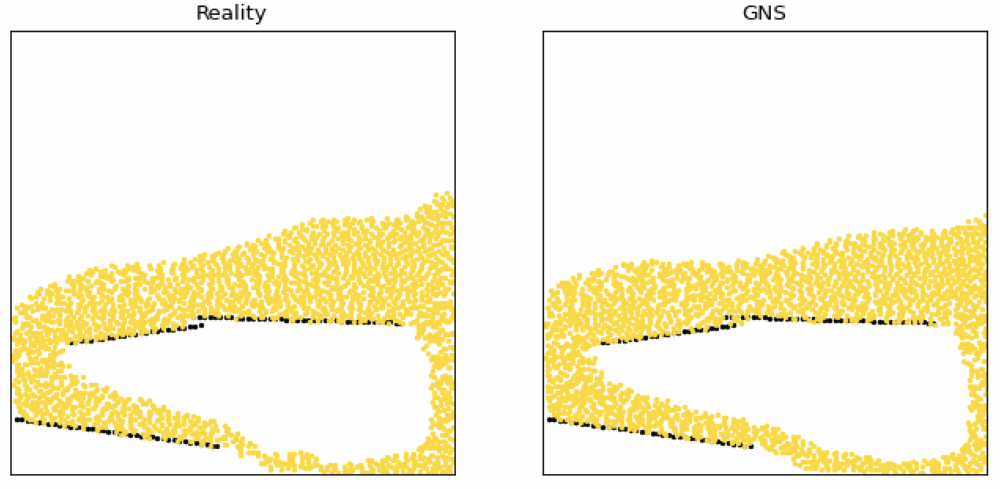

# Summary

Geometric Deep Learning (GDL) is a highly impactful sub-field of machine learning focused on non-Euclidean data structures, such as graphs [@sanchez2020learning,@battaglia2018relational].  Graphs are powerful data representations of many real-world applications, including particulate systems, material sciences, drug discovery, astrophysics, and engineering.  Graph Neural Networks (GNNs)[scarselli2008graph] are state-of-the-art GDL algorithms operating on graphs to represent rich relational information and local node features.  A GNN maps an input graph to an output graph with the same structure but potentially different node, edge, and global feature attributes.  

Fig. 1 shows an overview of the GNN learning to simulate n-body dynamics.  The graph network spans the physical domain with nodes representing an individual or a collection of particles, and the edges connecting the vertices represent the local interaction between particles or clusters of particles.  The GNN learns the dynamics, such as momentum and energy exchange, through a form of messages passing [@gilmer2017neural], where latent information propagates between nodes via the graph edges.  GNN has three components: (a) Encoder, which embeds particle information to a latent graph, the edges represent learned functions; (b) Processor, which allows data propagation and computes the nodal interactions across steps; and (c) Decoder, which extracts the relevant dynamics (e.g., particle acceleration) from the graph. 

GNN learns to predict the particle dynamics through message passing~\cite{sanchez2020learning}.  The GNN edge messages  ($e^\prime_k \leftarrow \phi^e(e_k, v_{r_k}, v_{s_k}, u)$) are a learned linear combination of the true forces.  The edge messages are aggregated at every node exploiting the principle of superposition $\bar{e_i^\prime} \leftarrow \sum_{r_k = i} e_i^\prime$.  The node then encodes the connected edge features and its local features using a neural network: $v_i^\prime \leftarrow \phi^v (\bar{e_i}, v_i, u)$.  The GNN implementation uses semi-implicit Euler integration to update the next state of the particles based on the predicted accelerations at the vertices.  We introduce physics-inspired simple inductive biases, such as an inertial frame that allows learning algorithms to prioritize one solution (constant gravitational acceleration) over another, reducing learning time.  GNS trained on particle simulations can predict the behavior of n-body particle dynamics, such as granular flows and water.  Fig 2. shows the GNS prediction of granular column collapse trained on 20 Million steps with 40 trajectories on NVIDIA A100 GPUs.  The trained model accurately predicts within 5\% of error compared to MPM simulations.  GNN trained on trajectory data is generalizable to predict particle kinematics in complex boundary conditions not seen during training.  We developed an open-source PyTorch GNN simulator (GNS) that can successfully predict the dynamics of fluid and particulate systems[@Kumar_Graph_Network_Simulator_2022].

# Statement of need

GNS [@sanchez2020learning]

The GNN simulator is scalable to 100,000 vertices and more than one million edges.

# State of the art

# Features 

# GNS training and prediction

# Parallelization and scaling

# Acknowledgements

We acknowledge the support of National Science Foundation NSF OAC: 2103937.

# References