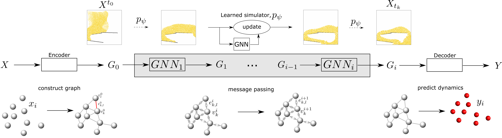

# Summary

Graph Network-based Simulator (GNS) is a framework for developing generalizable, efficient, and accurate surrogate models for particulate and fluid systems using Graph Neural Networks (GNNs).  GNNs are the state-of-the-art geometric deep learning (GDL) that operates on graphs to represent rich relational information[@scarselli2008graph], which maps an input graph to an output graph with the same structure but potentially different node, edge, and global feature attributes.  The graph network in GNS spans the physical domain with nodes representing an individual or a collection of particles, and the edges connecting the vertices represent the local interaction between particles or clusters of particles.  GNS computes the system dynamics via learned message passing.  \autoref{fig:gnn} shows an overview of how GNS learns to simulate n-body dynamics.  GNS has three components: (a) Encoder, which embeds particle information to a latent graph, the edges represent learned functions; (b) Processor, which allows data propagation and computes the nodal interactions across steps; and (c) Decoder, which extracts the relevant dynamics (e.g., particle acceleration) from the graph.  The GNS learns the dynamics, such as momentum and energy exchange, through a form of messages passing [@gilmer2017neural], where latent information propagates between nodes via the graph edges.  The GNS edge messages  ($e^\prime_k \leftarrow \phi^e(e_k, v_{r_k}, v_{s_k}, u)$) are a learned linear combination of the interaction forces.  The edge messages are aggregated at every node exploiting the principle of superposition $\bar{e_i^\prime} \leftarrow \sum_{r_k = i} e_i^\prime$.  The node then encodes the connected edge features and its local features using a neural network: $v_i^\prime \leftarrow \phi^v (\bar{e_i}, v_i, u)$.  



The GNS implementation uses semi-implicit Euler integration to update the next state of the particles based on the predicted accelerations at the nodes.  We introduce physics-inspired simple inductive biases, such as an inertial frame that allows learning algorithms to prioritize one solution (constant gravitational acceleration) over another, reducing learning time.  We developed an open-source PyTorch-based GNS that predicts the dynamics of fluid and particulate systems[@Kumar_Graph_Network_Simulator_2022].  \autoref{fig:gns-mpm} shows the GNS prediction of granular column collapse trained on 20 Million steps with 40 trajectories on NVIDIA A100 GPUs.  The trained model accurately predicts within 5\% of error compared to MPM simulations.  GNS trained on trajectory data is generalizable to predict particle kinematics in complex boundary conditions not seen during training.


# Statement of need

Traditional numerical methods for solving differential equations are invaluable in scientific and engineering disciplines.  However, such simulators are computationally expensive and intractable for solving large-scale and complex inverse problems, multiphysics, and multi-scale mechanics.  Surrogate models trade off generality for accuracy in a narrow setting.  Recent growth in data availability has spurred data-driven machine learning (ML) models that train directly from observed data [@prume2022model].  ML models require significant training data to cover the large state space and complex dynamics.  Instead of ignoring the vast amount of structured prior knowledge (physics), we can exploit such knowledge to construct physics-informed ML algorithms with limited training data~\citep{li2019time,hu2019difftaichi,haghighat2020sciann}.  GNS uses static and inertial priors to learn the interactions between particles directly on graphs and can generalize with limited training data [@wu2020comprehensive,@velivckovic2017graph].  Graph-based GNS offers powerful data representations of real-world applications, including particulate systems, material sciences, drug discovery, astrophysics, and engineering [@sanchez2020learning,@battaglia2018relational].

# State of the art

TensorFlow

# Key features 

The Graph Network Simulator (GNS) uses PyTorch and PyTorch Geometric for constructing graph and learned message passing. GNS is highly-scalable to 100,000 vertices and more than a million edges. GNS supports the following features:

- CPU and GPU training and predictions
- Parallel training on multi-GPUs
- Multi-material interactions
- Complex boundary conditions
- Checkpoint restart
- VTK results
- Animation postprocessing

# GNS training and prediction
## Dataset format
The data loader provided with this PyTorch implementation utilizes the more general `.npz` format.  
The `.npz` format includes a list of tuples of arbitrary length where each tuple is for a different training trajectory and is of the form `(position, particle_type)`.
GNS takes the last five positions as an input to predict the position at the next time step. 
The `position` is a 3-D tensor of shape `(n_time_steps, n_particles, n_dimensions)` and `particle_type` is a 1-D tensor of shape `(n_particles)`.  

The dataset contains:

* Metadata file with dataset information `(sequence length, dimensionality, box bounds, default connectivity radius, statistics for normalization, ...)`:

```
{"bounds": [[0.1, 0.9], [0.1, 0.9]], "sequence_length": 320, "default_connectivity_radius": 0.015, "dim": 2, "dt": 0.0025, "vel_mean": [5.123277536458455e-06, -0.0009965205918140803], "vel_std": [0.0021978993231675805, 0.0026653552458701774], "acc_mean": [5.237611158734309e-07, 2.3633027988858656e-07], "acc_std": [0.0002582944917306106, 0.00029554531667679154]}
```
* npz containing data for all trajectories `(particle types, positions, global context, ...)`:

Training dataset for Sand, SandRamps, and WaterDrop are available on [DesignSafe Data Depot](https://www.designsafe-ci.org/data/browser/public/designsafe.storage.published/PRJ-3702) [@vantassel2022gnsdata].

# Parallelization and scaling

# Acknowledgements

We acknowledge the support of National Science Foundation NSF OAC: 2103937.

# References